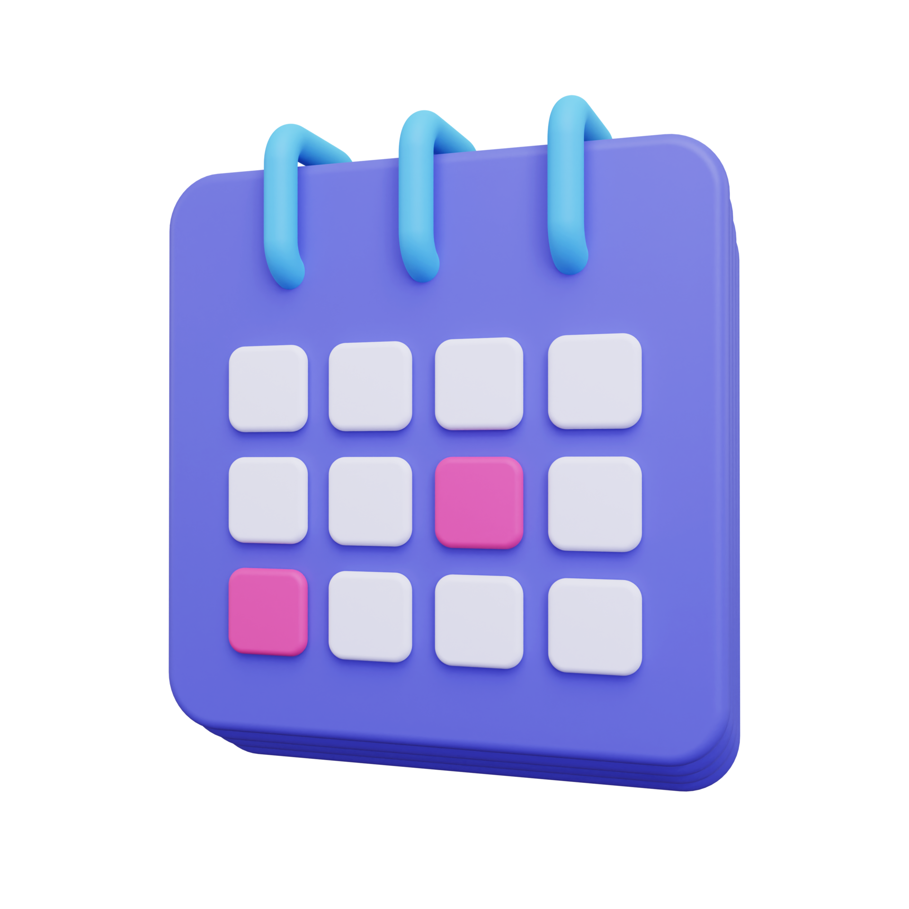
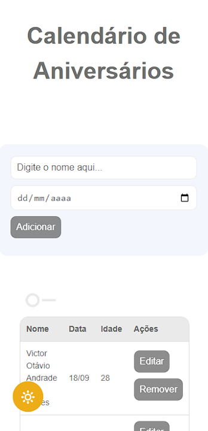

<a name="readme-top"></a>

[![Contributors][contributors-shield]][contributors-url]
[![Forks][forks-shield]][forks-url]
[![Stargazers][stars-shield]][stars-url]
[![Issues][issues-shield]][issues-url]
[![MIT License][license-shield]][license-url]
[![LinkedIn][linkedin-shield]][linkedin-url]

<br />
<div align="center">
  <a href="https://github.com/voaneves/calendario-de-aniversarios">
    
  </a>

  <h3 align="center">calendario-de-aniversarios</h3>

  <p align="center">
    Um site/calendário para guardar aniversários de quem é importante para você!
    <br />
    <a href="https://github.com/voaneves/calendario-de-aniversarios"><strong>Explore a documentação »</strong></a>
    <br />
    <br />
    <a href="https://voaneves.com/calendario-de-aniversarios">Ver o Demo</a>
    ·
    <a href="https://github.com/voaneves/calendario-de-aniversarios/issues">Reporte um bug</a>
    ·
    <a href="https://github.com/voaneves/calendario-de-aniversarios/issues">Solicite uma funcionalidade</a>
  </p>
</div>

<details>
  <summary>Sumário</summary>
  <ol>
    <li>
      <a href="#sobre-o-projeto">Sobre o projeto</a>
      <ul>
        <li><a href="#tecnologias-utilizadas">Tecnologias utilizadas</a></li>
      </ul>
    </li>
    <li><a href="#funcionalidades">Funcionalidades</a></li>
    <li><a href="#estrutura-do-projeto">Estrutura do projeto</a></li>
    <li><a href="#como-usar">Como usar</a></li>
    <li><a href="#to-do">To do</a></li>
    <li><a href="#reportando-bugs">Reportando bugs</a></li>
    <li><a href="#licença">Licença</a></li>
  </ol>
</details>

## Sobre o projeto

<p align="center">
  <a href="https://voaneves.com/calendario-de-aniversarios">
    
  </a>
</p>

Este repositório contém um projeto de calendário com funcionalidades de criação, leitura, atualização e exclusão (CRUD). O projeto foi desenvolvido para treinar conhecimentos obtidos no curso de Sistemas de Informação da XP Educação, no Bootcamp Programador de Software, módulo de Desenvolvimento Web.

<p align="right">(<a href="#readme-top">back to top</a>)</p>

### Tecnologias utilizadas

O projeto utiliza as seguintes tecnologias:

- HTML
- CSS
- JavaScript

A página está otimizada para todas as plataformas (cross-browser), como score do lighthouse abaixo.

[![Lighthouse][lighthouse-img]][lighthouse-link]

<p align="right">(<a href="#readme-top">back to top</a>)</p>

## Funcionalidades

O projeto possui as seguintes funcionalidades:

- Adicionar aniversários ao calendário através de um formulário.
- Exibir os aniversários na tabela abaixo do formulário.
- Editar informações de aniversários existentes.
- Remover aniversários da tabela.
- Alternar entre o tema claro e o tema escuro, com cores baseadas no Google Bard.
- O tabela calendário é gerida em JSON e possui persistência no localStorage.
- Ícones do icomoon.
- Botão para classificar por data de aniversário.

<p align="right">(<a href="#readme-top">back to top</a>)</p>

## Estrutura do projeto

O projeto possui a seguinte estrutura dos principais arquivos:

- index.html: arquivo HTML principal que contém a estrutura do calendário e os elementos interativos.
- style/style.css: arquivo CSS que define o estilo visual do calendário.
- script/script.js: arquivo JavaScript que contém a lógica de interação do calendário.
- fonts/theme.woff2: arquivo de fonte icomoon.
- README.md: arquivo de documentação do projeto (você está lendo este arquivo).

<p align="right">(<a href="#readme-top">back to top</a>)</p>

## Como usar

1. Faça o clone deste repositório em sua máquina:

   ```bash
   git clone https://github.com/seu-usuario/calendar-crud.git

   ```

2. Abra o arquivo index.html em um navegador web.

3. Utilize o formulário para adicionar aniversários ao calendário. Preencha o nome da pessoa e a data de nascimento e clique no botão "Adicionar".

4. Os aniversários adicionados serão exibidos na tabela abaixo do formulário. Cada aniversário terá opções para editar e remover.

5. O tema do calendário pode ser alterado clicando no botão de alternância de tema localizado no canto superior esquerdo.

<p align="right">(<a href="#readme-top">back to top</a>)</p>

## To do

- [x] Adicionar sorting para o array JSON dos aniversarios;
- [x] Com o toggle de sorting ligado, fazer com que a edição seja igual entre o array aniversarios e aniversariosSorted;
- [ ] Adicionar notificações para lembrete dos aniversários;
- [x] Transformar em webapp;
- [x] Melhorar estrutura da página, adicionar tags <meta> e otimizar entrega do javascript.

<p align="right">(<a href="#readme-top">back to top</a>)</p>

## Reportando Bugs

Encontrou algum bug ou problema no projeto? Siga as etapas abaixo:

1. Verifique se o bug ainda não foi relatado em nossa seção de "Issues" (problemas) no GitHub: [link para os Issues](https://github.com/voaneves/calendar-crud/issues).

2. Caso não tenha encontrado um relatório sobre o bug, clique em "New Issue" (novo problema) para abrir um novo relatório de bug.

3. Forneça um título claro e descritivo para o bug, juntamente com uma descrição detalhada dos passos necessários para reproduzi-lo.

4. Se possível, inclua capturas de tela, trechos de código relevantes ou outras informações que possam ajudar na identificação e resolução do bug.

5. Clique em "Submit Issue" (enviar problema) para criar o relatório de bug.

Obrigado por relatar bugs! Caso queira colaborar com código, você pode abrir um PR e sua participação é mais do que bem-vinda.

<p align="right">(<a href="#readme-top">back to top</a>)</p>

## Licença

Este projeto está licenciado sob a [MIT License](/LICENSE).

<p align="right">(<a href="#readme-top">back to top</a>)</p>

[contributors-shield]: https://img.shields.io/github/contributors/voaneves/calendario-de-aniversarios.svg?style=for-the-badge
[contributors-url]: https://github.com/voaneves/calendario-de-aniversarios/graphs/contributors
[forks-shield]: https://img.shields.io/github/forks/voaneves/calendario-de-aniversarios.svg?style=for-the-badge
[forks-url]: https://github.com/voaneves/calendario-de-aniversarios/network/members
[stars-shield]: https://img.shields.io/github/stars/voaneves/calendario-de-aniversarios.svg?style=for-the-badge
[stars-url]: https://github.com/voaneves.com/calendario-de-aniversarios/stargazers
[issues-shield]: https://img.shields.io/github/issues/voaneves/calendario-de-aniversarios.svg?style=for-the-badge
[issues-url]: https://github.com/voaneves/calendario-de-aniversarios/issues
[license-shield]: https://img.shields.io/github/license/voaneves/calendario-de-aniversarios.svg?style=for-the-badge
[license-url]: https://github.com/voaneves/calendario-de-aniversarios/blob/master/LICENSE.txt
[linkedin-shield]: https://img.shields.io/badge/-LinkedIn-black.svg?style=for-the-badge&logo=linkedin&colorB=555
[linkedin-url]: https://linkedin.com/in/voaneves
[calendario-de-aniversarios-logo]: img/calendario-de-aniversarios-logo.webp
[calendario-de-aniversarios-img]: img/calendario-de-aniversarios.png
[calendario-de-aniversarios-link]: https://voaneves.com/calendario-de-aniversarios
[lighthouse-img]: img/lighthouse_score.png
[lighthouse-link]: https://pagespeed.web.dev/analysis/https-voaneves-com-calendario-de-aniversarios/dy2zzoyur6?form_factor=mobile
